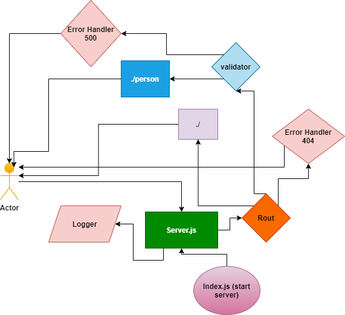

# basic-express-server

## Author: Amr Nzzal

## Links to check:  
* [Heroku application](https://amr-basic-express-server.herokuapp.com/)

* [Github actions](https://github.com/amr88nzzal/basic-express-server/actions)

* [Github pull request](https://github.com/amr88nzzal/basic-express-server/pull/2)

## Dependencies:
- dotenv
- express
- jest
- supertest

## How to start the server:  
- npm start

## What should I run on the terminal or postman?
- npm run start /on the terminal
- GET - http://localhost:3030/
- GET - http://localhost:3030/person
- GET - http://localhost:3030/person?name=your-name

## UML

